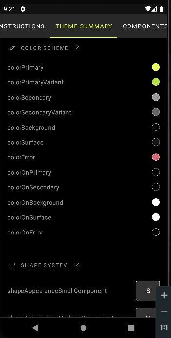

##Cambio de colores 
Aplicacion en Tema claro y oscuro

Paleta de colores 
Priamario:  #E8FF5C    #B4DF45   #7FA123
Secundario: #9E9895 #676664

##Colores
 

##Vista en botones

##Cambio en appBar
 
(

##Cambio de fuente y tamaño 
Fuente: Montserrat

