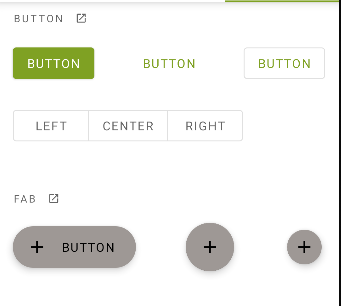
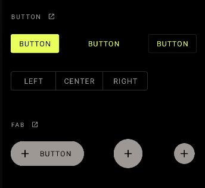

## Cambio de colores 
Aplicacion en Tema claro y oscuro

Paleta de colores 
Priamario:  #E8FF5C    #B4DF45   #7FA123
Secundario: #9E9895    xº#676664

## Colores
 

## Vista en botones

## Cambio en appBar
 
(

## Cambio de fuente y tamaño 
Fuente: Montserrat

